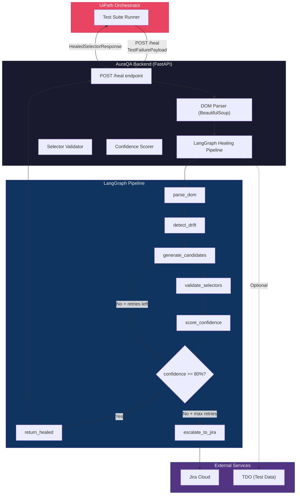

<!-- README.md -->
<!-- /// README.md -->

# 🔮 AuraQA — Self-Healing Enterprise Test Automation Engine

> **AuraQA** detects broken UI selectors in UiPath test suites, heals them using LangGraph-powered AI agents, and creates auditable Jira tickets — all automatically.

[](https://github.com/your-org/AuraQA/actions/workflows/ci.yml)
[](https://github.com/your-org/AuraQA/actions/workflows/deploy.yml)

---

## 📋 Table of Contents

- [Overview](#overview)
- [Architecture](#architecture)
- [Project Structure](#project-structure)
- [Quick Start](#quick-start)
- [Development Setup](#development-setup)
- [API Documentation](#api-documentation)
- [Testing](#testing)
- [Docker & Deployment](#docker--deployment)
- [Configuration](#configuration)
- [Contributing](#contributing)

---

## Overview

When a UiPath RPA test fails because a CSS/XPath selector no longer matches the DOM, AuraQA:

1. **Receives** the failure payload (broken selector + DOM snapshot)
2. **Parses** the DOM and extracts candidate elements via BeautifulSoup
3. **Analyzes** drift type (ID rename, class swap, nesting change, etc.)
4. **Generates** healed selector candidates using LangGraph AI agents
5. **Validates** candidates against the DOM with confidence scoring
6. **Returns** the best healed selector to UiPath or **escalates** to Jira

---

## Architecture



---

## Project Structure

```
AuraQA/
├── backend/                    # Python backend
│   ├── __init__.py
│   ├── main.py                 # FastAPI application entry point
│   ├── config/
│   │   └── env_schema.py       # Pydantic Settings (AURAQA_* env vars)
│   ├── models/
│   │   └── schemas.py          # All Pydantic models & TypedDicts
│   ├── graph/
│   │   ├── nodes/              # LangGraph pipeline nodes
│   │   ├── edges/              # LangGraph conditional edges
│   │   └── tools/              # LangGraph tool definitions
│   ├── services/               # Business logic services
│   └── tests/                  # Pytest test suite
├── mock_app/                   # React mock app (test target)
├── contracts/                  # JSON contract fixtures
│   ├── failure_payload.json
│   ├── healed_response.json
│   └── audit_log.json
├── infrastructure/
│   ├── Dockerfile              # Backend image
│   ├── Dockerfile.mockapp      # React app image (multi-stage)
│   ├── docker-compose.yml      # Full-stack orchestration
│   ├── nginx.conf              # Reverse proxy config
│   └── .env.example            # Environment variable template
├── scripts/
│   ├── setup.sh                # Dev environment setup
│   └── run_e2e.sh              # E2E test runner
├── .github/workflows/
│   ├── ci.yml                  # CI pipeline (lint, type, test, build)
│   └── deploy.yml              # CD pipeline (Docker + UiPath deploy)
├── pyproject.toml              # Python project config
├── requirements.txt            # Pinned Python dependencies
├── .pylintrc                   # Pylint config
├── mypy.ini                    # Mypy strict config
├── .gitignore                  # Git ignore rules
└── README.md                   # This file
```

---

## Quick Start

### Prerequisites

| Tool       | Version  | Purpose                    |
|------------|----------|----------------------------|
| Python     | ≥ 3.10   | Backend runtime            |
| Node.js    | ≥ 18     | Mock app build             |
| Docker     | ≥ 24     | Containerization           |
| Docker Compose | ≥ 2.20 | Multi-service orchestration |

### One-Command Setup

```bash
# Clone and setup
git clone https://github.com/your-org/AuraQA.git
cd AuraQA
chmod +x scripts/*.sh
./scripts/setup.sh
```

### Start with Docker

```bash
cd infrastructure
docker compose up --build
```

Services will be available at:

| Service       | URL                          |
|---------------|------------------------------|
| Nginx Proxy   | http://localhost              |
| Backend API   | http://localhost:8000         |
| API Docs      | http://localhost:8000/docs    |
| Mock App      | http://localhost:5173         |

---

## Development Setup

### Manual Setup

```bash
# 1. Create virtual environment
python3 -m venv .venv
source .venv/bin/activate

# 2. Install dependencies
pip install -r requirements.txt
pip install pylint mypy  # dev tools

# 3. Configure environment
cp infrastructure/.env.example .env
# Edit .env with your API keys

# 4. Start the backend
uvicorn backend.main:app --reload --host 0.0.0.0 --port 8000
```

### Mock App (Development)

```bash
cd mock_app
npm install
npm run dev   # Starts on http://localhost:5173
```

---

## API Documentation

### `POST /heal`

Submit a test failure for healing.

**Request Body:** `TestFailurePayload`

```json
{
  "test_case_id": "TC-001",
  "test_suite_id": "TS-SMOKE",
  "broken_selector": "#old-submit-btn",
  "selector_type": "css",
  "dom_snapshot": "<html>...</html>",
  "original_element_attributes": {
    "tag": "button",
    "element_id": "old-submit-btn",
    "classes": ["btn", "primary"],
    "text": "Submit"
  },
  "page_url": "https://app.example.com/form",
  "error_message": "Element not found: #old-submit-btn"
}
```

**Response:** `HealedSelectorResponse`

```json
{
  "test_case_id": "TC-001",
  "original_selector": "#old-submit-btn",
  "healed_selector": "[data-testid='submit-button']",
  "healed_selector_type": "css",
  "confidence": 95.5,
  "status": "healed",
  "candidates_evaluated": 12,
  "drift_type": "id_rename",
  "attempt_count": 1,
  "execution_time_ms": 342.7
}
```

### `GET /health`

Health check endpoint.

```json
{
  "status": "healthy",
  "version": "1.0.0"
}
```

---

## Testing

### Run All Tests

```bash
pytest
```

### Run by Marker

```bash
pytest -m unit          # Fast unit tests only
pytest -m integration   # Integration tests
pytest -m e2e           # Full E2E (requires Docker)
```

### Run E2E Suite (with Docker)

```bash
./scripts/run_e2e.sh
```

This script will:
1. Build and start all Docker services
2. Wait for health checks to pass
3. Run `pytest -m e2e`
4. Tear down all services

### Coverage Report

```bash
pytest --cov=backend --cov-report=html
open reports/coverage/index.html
```

---

## Docker & Deployment

### Local Docker

```bash
cd infrastructure
docker compose up --build -d    # Start all services
docker compose logs -f backend  # Follow backend logs
docker compose down -v          # Stop and clean up
```

### Production Deployment

The CD pipeline (`.github/workflows/deploy.yml`) handles:

1. **Docker Build & Push** — Images pushed to GitHub Container Registry
2. **UiPath Deploy** — Package deployed via `uip` CLI to Orchestrator

Required GitHub Secrets:

| Secret                      | Description                         |
|-----------------------------|-------------------------------------|
| `UIPATH_ORCHESTRATOR_URL`   | UiPath Orchestrator base URL        |
| `UIPATH_TENANT`             | UiPath tenant name                  |
| `UIPATH_CLIENT_ID`          | OAuth client ID                     |
| `UIPATH_CLIENT_SECRET`      | OAuth client secret                 |
| `UIPATH_FOLDER_ID`          | Target folder/organization ID       |

---

## Configuration

All configuration is via environment variables prefixed with `AURAQA_`.

See [`infrastructure/.env.example`](infrastructure/.env.example) for the complete list.

| Variable                        | Default          | Description                   |
|---------------------------------|------------------|-------------------------------|
| `AURAQA_APP_ENV`                | `development`    | Environment name              |
| `AURAQA_DEBUG`                  | `false`          | Enable debug mode             |
| `AURAQA_LOG_LEVEL`              | `INFO`           | Logging level                 |
| `AURAQA_API_PORT`               | `8000`           | Backend API port              |
| `AURAQA_CONFIDENCE_THRESHOLD`   | `80.0`           | Min confidence for healing    |
| `AURAQA_LANGGRAPH_MAX_RETRIES`  | `3`              | Max healing retry attempts    |
| `AURAQA_JIRA_BASE_URL`          | —                | Jira instance URL             |
| `AURAQA_UIPATH_ORCHESTRATOR_URL`| —                | UiPath Orchestrator URL       |

---

## Contributing

1. Fork the repository
2. Create a feature branch: `git checkout -b feature/my-feature`
3. Run quality checks:
   ```bash
   pylint backend/
   mypy backend/
   pytest
   ```
4. Commit with conventional commits: `feat:`, `fix:`, `docs:`, `ci:`
5. Open a Pull Request against `main`

---

<p align="center">
  Built with ❤️ by the AuraQA Team<br/>
  <sub>FastAPI · LangGraph · UiPath · BeautifulSoup</sub>
</p>
